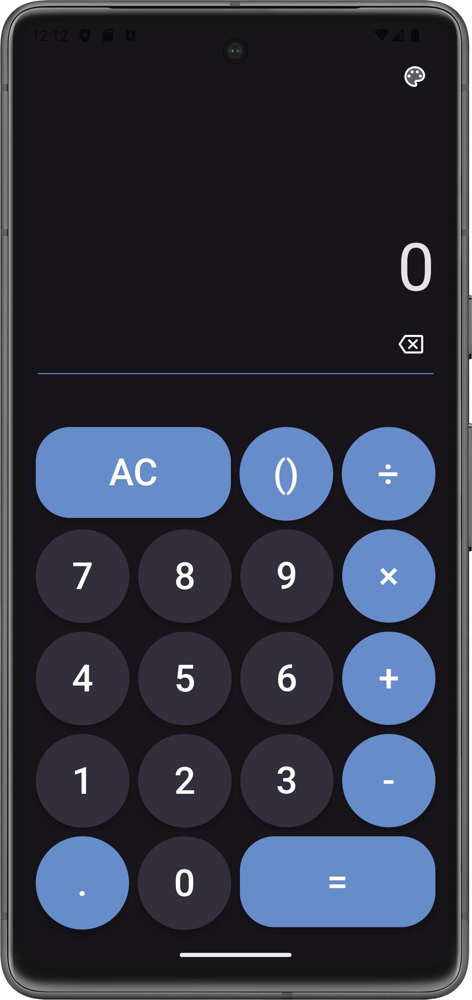
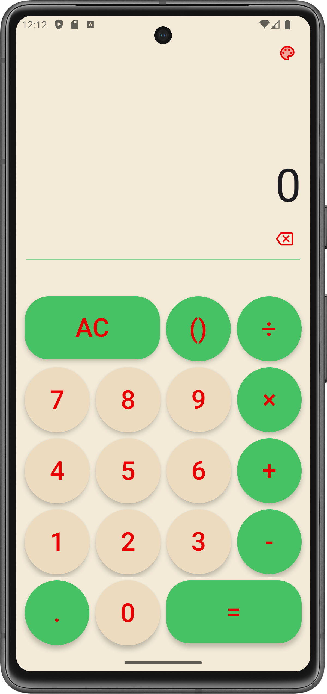
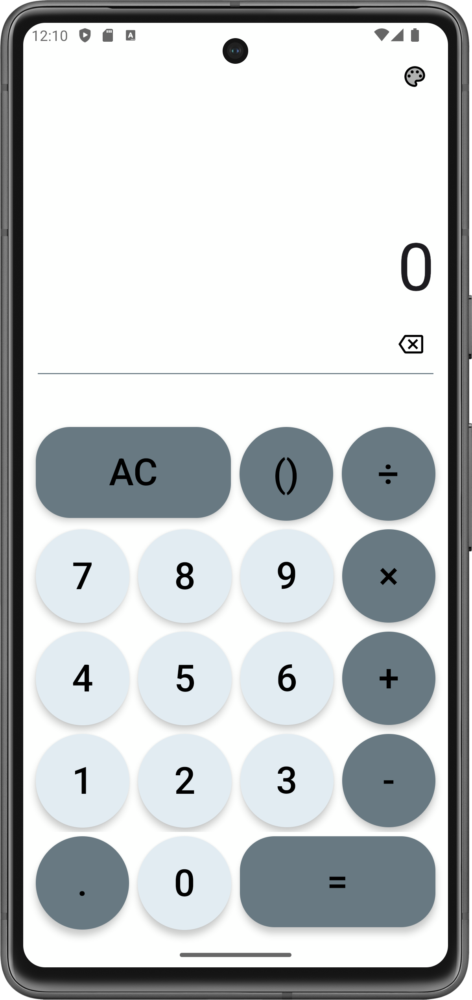

# Calculator App - Jetpack Compose

This is a dynamic UI **Calculator App** that uses Jetpack Compose for a responsive, modern interface across devices. It offers Dark, Warm, and Light themes and follows the MVVM architecture, incorporating the repository pattern for clean code. It supports basic arithmetic, handles errors gracefully.

## 📷 Preview

  

  <video width="210" controls>
    <source src="media/PreviewGif01.mp4" type="video/mp4">
    Your browser does not support the video tag.
  </video>

  
  
  

## 📱 Get Apk
[APK](Apk)

## 🔥 Features

- **Dynamic UI**

    The calculator's interface adjusts dynamically to provide a responsive and user-friendly experience across various devices and screen sizes.
- **Three Themes**

  - **Dark Theme** :
    Designed to be easy on the eyes and ideal for low-light environments.
  - **Warm Theme** :
    Offers a unique and personalized look with warmer tones.
  - **Light Theme** :
    Provides a clean and bright interface, perfect for well-lit conditions.

- **MVVM Architecture**
  - **Model** :
    Manages the data and business logic of the application.
   - **ViewModel** :
     Acts as a mediator between the View and the Model, handling the app's logic and preparing observable data for the View.
  - **View** :
    Displays data and captures user input, updating the UI based on the ViewModel's observable data.

- **Repository Pattern**

  Implements a clean and modular way to handle data operations, ensuring a separation of concerns and making the codebase more maintainable.
- **Additional Features**
 
  Supports basic arithmetic operations such as addition, subtraction, multiplication, and division.
  
  Error Handling: Gracefully handles user input errors and displays appropriate error messages.

## 🏛️ Architecture
The architecture used in this project is [Android recommended architecture](https://developer.android.com/courses/pathways/android-architecture),
which I personally believe is a combination of some layers and principles of three architectures MVVM, MVI and Clean, which makes it great.

## 🚀 Jetpack Compose

* [Jetpack Compose](https://developer.android.com/jetpack/compose)
* [Jetpack Compose App](https://jetpackcompose.app/) -  Comparison of existing UI widgets and Jetpack Compose
* [Android Basics with Compose Course](https://developer.android.com/courses/android-basics-compose/course)
* [Compose performance Doc](https://developer.android.com/jetpack/compose/performance)
* [Jetpack Compose Component List](https://www.composables.com/components) – List of all components you can use in Jetpack Compose

## 🙏 Acknowledgements 

Special thanks to the [Rhino team](https://github.com/mozilla/rhino) for their excellent work on the JavaScript engine.

### Dependencies

This project uses the [Rhino JavaScript Engine](https://github.com/mozilla/rhino) by Mozilla for its JavaScript processing. Rhino is a JavaScript runtime written in Java and developed primarily by Mozilla.

### How to use Rhino

To use Rhino in your project, include it as a dependency in your build configuration. For more details, refer to the [Rhino GitHub repository](https://github.com/mozilla/rhino).

## 📰 Updates
- 28 July, 2024 - **Released !**

## 🪪 License
[MIT Licence](LICENSE)
